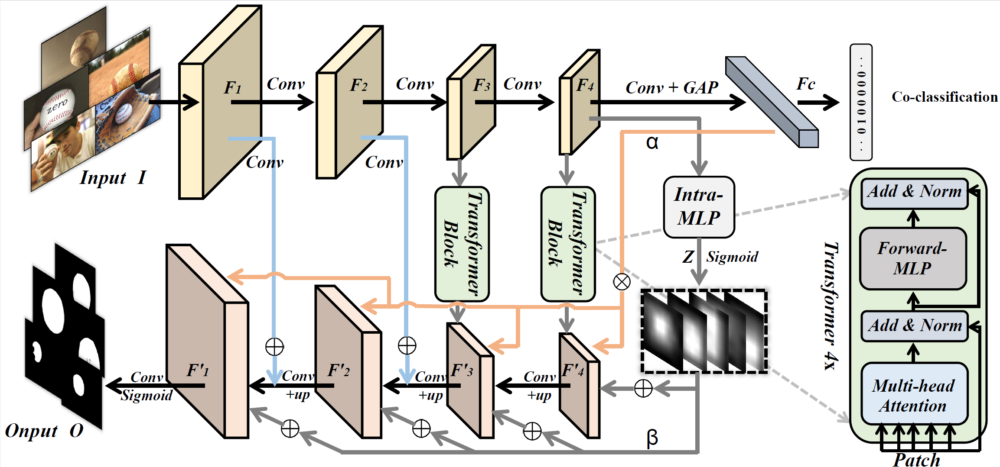
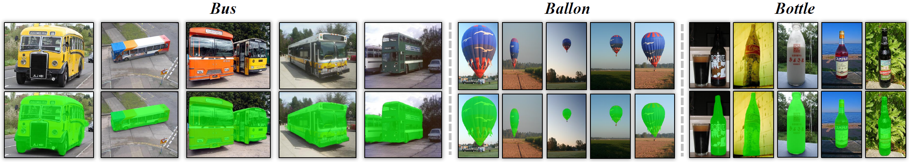
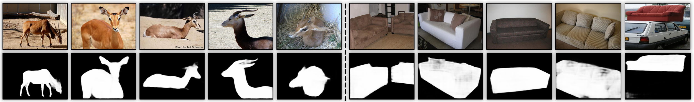

--------------------------------------------------------------------------------

# A Unified Transformer Framework for Group-based Segmentation: Co-Segmentation, Co-Saliency Detection and Video Salient Object Detection

[](https://paperswithcode.com/sota/co-salient-object-detection-on-cosal2015?p=a-unified-transformer-framework-for-group)  [](https://paperswithcode.com/sota/co-salient-object-detection-on-cosod3k?p=a-unified-transformer-framework-for-group)  [](https://paperswithcode.com/sota/co-salient-object-detection-on-coca?p=a-unified-transformer-framework-for-group)  [](https://paperswithcode.com/sota/co-salient-object-detection-on-icoseg?p=a-unified-transformer-framework-for-group)

[](https://paperswithcode.com/sota/video-salient-object-detection-on-segtrack-v2?p=a-unified-transformer-framework-for-group)  [](https://paperswithcode.com/sota/video-salient-object-detection-on-visal?p=a-unified-transformer-framework-for-group)  [](https://paperswithcode.com/sota/video-salient-object-detection-on-fbms-59?p=a-unified-transformer-framework-for-group)  [](https://paperswithcode.com/sota/video-salient-object-detection-on-davis-2016?p=a-unified-transformer-framework-for-group)

## Update

**22/07/2022** Add demo to [Huggingface Spaces](https://huggingface.co/spaces) with [Gradio](https://github.com/gradio-app/gradio).

|                    Paper Link                     |                       Huggingface Demo                       |
| :-----------------------------------------------: | :----------------------------------------------------------: |
| **[[paper](https://arxiv.org/abs/2203.04708v2)]** | **[](https://huggingface.co/spaces/djl234/UFO)** |

UFO is a simple and Unified framework for addressing Co-Object Segmentation tasks: Co-Segmentation, Co-Saliency Detection and Video Salient Object Detection. Humans tend to mine objects by learning from a group of images or a several frames of video since we live in a dynamic world. In computer vision area, many researches focus on co-segmentation (CoS), co-saliency detection (CoSD) and video salient object detection (VSOD) to discover the co-occurrent objects. However, previous approaches design different networks on these tasks separately, which lower the upper bound on the ease of use of deep learning frameworks. In this paper, we introduce a unified framework to tackle these issues, term as <b>UFO</b> (<b>U</b>nified <b>F</b>ramework for Co-<b>O</b>bject Segmentation). All tasks share the same framework.        

## Task & Framework



## Usage

### Requirement

```python
torch >= 1.7.0
torchvision >= 0.7.0
python3
```

### Training

Training on group-based images. We use [COCO2017 train set](https://cocodataset.org/#home) with the provided [group split dict.npy](https://drive.google.com/file/d/1l-KY8JtUu1pfQ4Xd3s0JNrkLM69oT_Ud/view?usp=sharing).

```bash
python main.py
```

Training on video (w/o flow) . We load the weight pre-trained on the static image dataset, and use [DAVIS and FBMS](https://drive.google.com/file/d/1LwqQi7axAgQhf3O-wHWj_MkYBEXNn8gQ/view?usp=sharing) to train our framework.

```bash
python finetune.py --model=models/image_best.pth --use_flow=False
```

Training on video (w/ flow). The same as above, then we use [DAVIS_flow and FBMS_flow](https://drive.google.com/file/d/1yS_-gvBH7au-BzsoM0qbwJ6Uz7kU0z85/view?usp=sharing) to train our network.

```bash
python finetune.py --model=models/image_best.pth --use_flow=True
```

### Inference

Generate the image results [[checkpoint](https://drive.google.com/file/d/1ZFJwxBFTekAAxGuDMoafP4slTS_dBe3O/view?usp=sharing)]

```bash
python test.py --model=models/image_best.pth --data_path=CoSdatasets/MSRC7/ --output_dir=CoS_results/MSRC7 --task=CoS_CoSD
```

Generate the video results [[checkpoint](https://drive.google.com/file/d/1eIAoCy-sV_9ueC9-KmQKDyc8nex2yWxL/view?usp=sharing)]

```bash
python test.py --model=models/video_best.pth --data_path=VSODdatasets/DAVIS/ --output_dir=VSOD_results/wo_optical_flow/DAVIS --task=VSOD
```

Generate the video results with optical flow [[checkpoint](https://drive.google.com/file/d/1NtX86od0jlukYlF2EIKsFYxZdjBW2pL6/view?usp=sharing)]

```bash
python test.py --model=models/video_flow_best.pth --data_path=VSODdatasets/DAVIS_flow/ --output_dir=VSOD_results/w_optical_flow/w_optical_flow --use_flow=True --task=VSOD
```

### Evaluation

- Pre-Computed Results: Please download the prediction results of our framework form the Results section.
- Evaluation Toolbox: We use the standard evaluation toolbox from [COCA benchmark](http://zhaozhang.net/coca.html).

## Result

- **Co-Segmentation (CoS) on [PASCAL-VOC](http://host.robots.ox.ac.uk/pascal/VOC/), [iCoseg](http://chenlab.ece.cornell.edu/projects/touch-coseg/), [Internet](http://people.csail.mit.edu/mrub/ObjectDiscovery/) and [MSRC](https://link.springer.com/chapter/10.1007/11744023_1)  [[Pre-computed Results](https://drive.google.com/drive/folders/1aLNYQDeG6ibbxsfI686TJKRbjj6nDF0U?usp=sharing)]** 



- **Co-Saliency Detection(CoSD) on [CoCA](http://zhaozhang.net/coca.html)，[CoSOD3k](http://dpfan.net/CoSOD3K/) and [CoSal2015](https://ieeexplore.ieee.org/abstract/document/7298918)  [[Pre-computed Results](https://drive.google.com/drive/folders/1QCr0zCCIsBC7JEHBS6A1O3V2JIpEAHyr?usp=sharing)]**



- **Video Salient Object Detection (VSOD) on [DAVIS16 val set](https://davischallenge.org/davis2016/code.html)  [[Pre-computed Results](https://drive.google.com/drive/folders/1iv6Rrdn3r2S5g5BSdViXT-vTX1pJUlBq?usp=sharing)]** 

 

- **[Optional] Single Object Tracking (SOT) on [GOT-10k val set](http://got-10k.aitestunion.com/downloads)** 


## Demo

```bash
python demo.py --data_path=./demo_mp4/video/kobe.mp4 --output_dir=./demo_mp4/result
```

https://user-images.githubusercontent.com/50760123/156528285-59b0a056-fb07-4c1e-8e66-cae31dc0e789.mp4

```bash
bash demo_bullet_chat.sh
```

https://user-images.githubusercontent.com/50760123/156924040-c329075f-1d50-41cd-a869-885b2f33d873.mp4

## Citation

If you find the code useful, please consider citing our paper using the following BibTeX entry.

```latex
@misc{2203.04708,
Author = {Yukun Su and Jingliang Deng and Ruizhou Sun and Guosheng Lin and Qingyao Wu},
Title = {A Unified Transformer Framework for Group-based Segmentation: Co-Segmentation, Co-Saliency Detection and Video Salient Object Detection},
Year = {2022},
Eprint = {arXiv:2203.04708},
}

```


## Acknowledgement

Our project references the codes in the following repos.

- [SSNM](https://github.com/cj4L/SSNM-Coseg)
- [VIT](https://github.com/google-research/vision_transformer)


